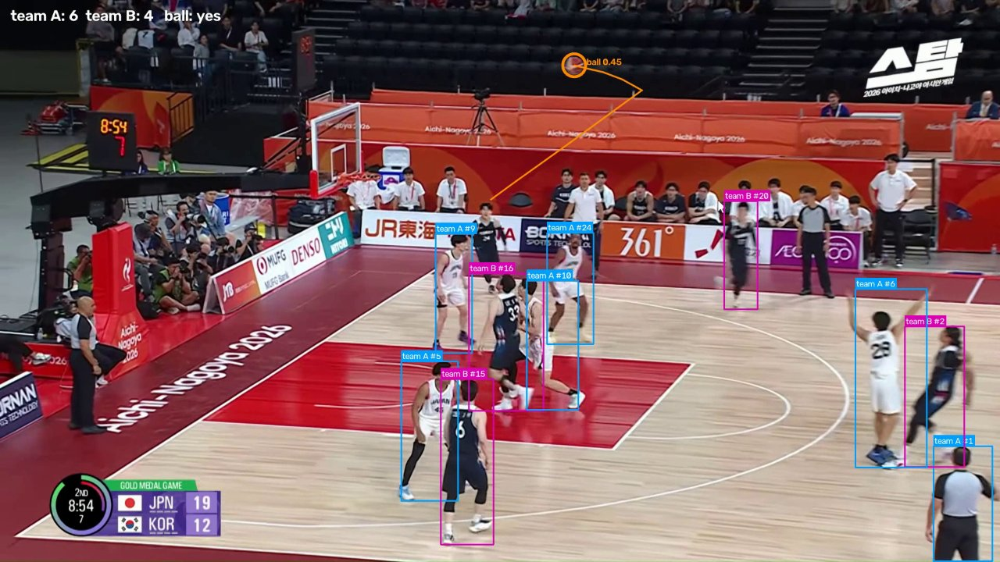
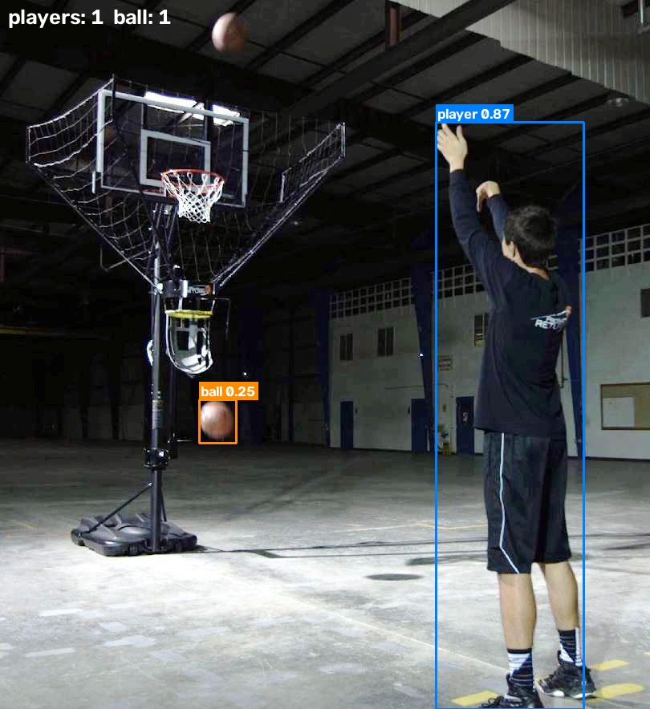

# 농구 선수 · 공 탐지 (YOLO11 / YOLOv5)

## YOLO11 버전 (`detect_basketball_yolo11.py`)

농구 중계 영상에서 **선수**와 **공**을 탐지·추적합니다.

| 단계 | 방법 |
|---|---|
| 탐지 | **YOLOE-11** (텍스트 프롬프트 `"person"`, `"basketball"`) — 기본값 `weights/yoloe-11l-seg.pt` |
| 선수 필터 | 나무 바닥 색으로 코트 영역(볼록 껍질)을 구하고 **발 위치가 코트 안**인 사람만 선수로 인정 → 관중·벤치·사진기자·코트 밖 심판 제거 |
| 추적 | ByteTrack으로 선수마다 ID 부여 |
| 팀 분류 | 상체(유니폼) 픽셀의 밝음/중간/어두움 비율 + 채도를 k-means로 2개 군집 → `team A`(밝은 유니폼) / `team B`(어두운 유니폼), 트랙별 다수결 |
| 공 | 프레임당 1개 선택(직전 위치와 가까운 후보 우선), 8프레임 이하 공백은 선형 보간, 최근 15프레임 궤적 표시 |

### 실행

```bash
pip install -r requirements-yolo11.txt
./download_weights.sh yoloe-11l-seg     # 기본 모델 (빠르게: yoloe-11s-seg)
python detect_basketball_yolo11.py --source data/videos/game.mp4 --out runs/yolo11
```

처음 실행하면 YOLOE 텍스트 인코더(`mobileclip_blt.ts`, 572MB)가 `weights/`에 내려받아집니다.

주요 옵션

| 옵션 | 기본값 | 설명 |
|---|---|---|
| `--weights` | `weights/yoloe-11l-seg.pt` | YOLOE-11, COCO YOLO11(`yolo11s.pt` 등), 또는 `player`/`ball` 클래스로 파인튜닝한 YOLO11 |
| `--imgsz` | 1280 | 1080p 영상의 작은 공 때문에 640보다 크게 |
| `--conf-player` / `--conf-ball` | 0.40 / 0.10 | 클래스별 신뢰도 임계값 |
| `--teams` | 2 | 0=끔, 3=두 팀 + 심판(가장 작은 군집) |
| `--no-court-filter` | | 코트 필터 끄기 (코트가 안 보이는 영상) |
| `--show-court` | | 검출된 코트 경계 표시 |
| `--max-ball-gap` | 8 | 공 위치 보간 최대 공백(프레임) |
| `--max-frames` | 0 | 앞 N프레임만 처리 (테스트용) |

출력: `<이름>_yolo11.mp4`(주석 영상), `detections.csv`(`frame, object, track_id, team, conf, x1..y2, interpolated`), `summary.json`.

### 실행 결과 — 업로드한 경기 영상 (1920×1080, 30fps, 198프레임, CPU)



| 항목 | 값 |
|---|---|
| 처리 속도 | 약 1 fps (CPU, yoloe-11l, imgsz 1280) — 198프레임 약 3.5분 |
| 선수가 있는 프레임 | 171 / 198 (앞 약 27프레임은 "2쿼터" 타이틀 화면) |
| 프레임당 선수 수(평균) | 7.8명 (화면 밖 선수 제외) |
| 공 탐지 | 102 / 198 프레임, 보간 포함 138 프레임 (경기 화면 171프레임 기준 60% → 81%) |
| 공 탐지 정확도(육안) | 탐지 결과를 하나씩 확인했을 때 오탐은 손을 공으로 잡은 1~2건뿐 |

### 모델 비교 (같은 영상, 3프레임마다 샘플 66장, 공 신뢰도 ≥ 0.2)

| 모델 | 공 탐지 프레임 | 비고 |
|---|---|---|
| YOLO11s (COCO, 1280) | 9 / 66 | 대부분 손·신발 오탐, 손에 든 공·공중의 공 놓침 |
| YOLO11m (COCO, 1280) | 8 / 66 | |
| YOLO11x (COCO, 2×2 타일) | 12 / 66 | 4배 느림 |
| **YOLOE-11s** ("basketball") | 22 / 66 | |
| **YOLOE-11l** ("basketball") | **29 / 66** | 손에 든 공, 공중의 공 모두 탐지 → 기본값 |

COCO의 `sports ball` 클래스는 중계 화면의 농구공을 거의 못 잡아서, 같은 YOLO11 백본에 텍스트 프롬프트를 쓰는 YOLOE-11을 기본으로 했습니다.
YOLO11 COCO 모델로도 실행할 수 있습니다: `--weights weights/yolo11s.pt`.

### 한계
- **심판**: YOLOE에 `"referee"` 프롬프트를 줘도 모두 `person`으로 나왔고, 이 경기의 회색 줄무늬 심판복은 밝기 분포로도 흰 유니폼과 잘 구분되지 않았습니다.
  그래서 기본값은 2팀이며, **코트 안에 서 있는 심판은 한 팀으로 분류**됩니다 (코트 밖 심판은 코트 필터로 제거됨).
- **ID 교체**: 두 선수가 겹쳤다 떨어질 때 ByteTrack ID가 바뀌면 팀 라벨도 같이 바뀔 수 있습니다.
- 코트 필터는 나무 바닥 색(HSV)에 맞춰져 있어, 바닥 색이 다른 경기장이면 `court_polygon()` 의 색 범위를 조정하거나 `--no-court-filter` 를 쓰세요.
- 정확도를 더 올리려면 `player / referee / ball` 라벨이 있는 농구 데이터셋으로 YOLO11을 파인튜닝한 뒤 `--weights` 로 넘기면 됩니다 (클래스 이름 `player`, `ball` 자동 인식).

업로드한 경기 영상(`data/videos/game.mp4`)과 결과 영상은 저장소에 올리지 않았습니다(`.gitignore`). 대신 결과 프레임 몇 장을 `runs/yolo11/frames/` 에 넣었습니다.

---

## YOLOv5 버전 (`detect_basketball.py`)

COCO로 사전학습된 YOLOv5 모델로 농구 영상/이미지에서 **선수(person)** 와 **농구공(sports ball)** 을 탐지합니다.
80개 COCO 클래스 중 `0: person → player`, `32: sports ball → ball` 두 클래스만 사용하고,
공은 작고 흐릿해서 점수가 낮게 나오기 쉬우므로 클래스별 신뢰도 임계값을 따로 둡니다 (선수 0.40, 공 0.15).

### 설치 및 실행

```bash
pip install -r requirements.txt
./download_weights.sh            # weights/yolov5s.pt (yolov5m 등도 가능)

# 이미지 폴더
python detect_basketball.py --source data/images --out runs/images
# 동영상
python detect_basketball.py --source data/videos/sample_video.mp4 --out runs/videos
```

주요 옵션: `--weights`, `--imgsz` (기본 640), `--conf-player`, `--conf-ball`, `--iou`, `--device cpu|0`.

출력 (`--out` 디렉터리):
- 박스가 그려진 이미지 / 동영상(`.mp4`)
- `detections.csv`, `detections.json` — `source, frame, label, conf, x1, y1, x2, y2`

### 실행 결과 (yolov5s, CPU)

| 입력 | 결과 |
|---|---|
| `sample_image.jpg` | player 1 (0.86), ball 1 (0.64) |
| `sample_image2.jpg` | player 1 (0.88), ball 1 (0.22) |
| `sample_image3.jpg` | player 1 (0.87), ball 1 (0.25) — 두 번째 공(화면 위쪽)은 놓침 |
| `sample_video.mp4` (960×540, 101프레임) | 모든 프레임에서 선수 탐지, 공은 43% 프레임에서 탐지 · 약 10초 |



### 관찰 및 한계
- `--imgsz 1280` 은 오히려 성능이 떨어졌습니다 (yolov5s는 640으로 학습됨; 1280에서 sample_image의 공을 놓침).
- 사전학습 COCO 모델이라 **손에 쥔 공**, **림 근처에서 모션 블러가 생긴 공** 은 자주 놓칩니다.
  정확도가 필요하면 농구 데이터셋(예: Roboflow Universe의 basketball 데이터셋)으로 파인튜닝하거나
  `--weights weights/yolov5m.pt` 처럼 큰 모델을 쓰는 것을 권장합니다.
- PyTorch 2.6+ 에서는 `torch.load` 기본값이 `weights_only=True` 로 바뀌어 공식 YOLOv5 체크포인트를 읽지 못하므로,
  스크립트가 `TORCH_FORCE_NO_WEIGHTS_ONLY_LOAD=1` 을 설정합니다. 신뢰할 수 있는 가중치만 사용하세요.

### 샘플 데이터 출처
`data/` 의 이미지와 동영상은 [chonyy/AI-basketball-analysis](https://github.com/chonyy/AI-basketball-analysis) 저장소의 샘플입니다.
